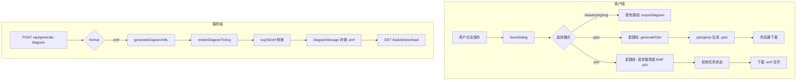
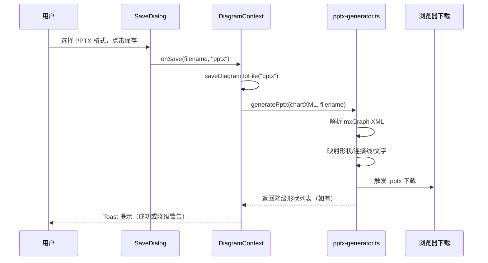

# 技术设计文档：PPT 可编辑导出

## 概述

本功能在现有图表导出体系之上，新增 **EMF** 和 **PPTX** 两种 PowerPoint 兼容格式的导出能力。

现有导出流程分为两条路径：
- **客户端路径**：`SaveDialog` → `DiagramContext.saveDiagramToFile` → draw.io `exportDiagram` → 浏览器下载
- **服务端 API 路径**：`POST /api/generate-diagram` → `TaskManager` → `DiagramRenderer`（Puppeteer）→ `DiagramStorage` → `GET /api/generate-diagram/[taskId]/download`

新格式将沿用这两条路径，并在各自的关键节点插入格式转换逻辑：
- **EMF**：SVG → EMF，由服务端 Node.js 库完成转换
- **PPTX**：mxGraph XML → PPTX 原生形状，由客户端 `pptxgenjs` 库完成生成

### 技术选型

| 格式 | 转换方向 | 执行环境 | 依赖库 |
|------|----------|----------|--------|
| EMF  | SVG → EMF | 服务端（Node.js API Route） | `potrace` + 自定义 EMF 编码器，或 `svg2emf` |
| PPTX | mxGraph XML → PPTX | 客户端（浏览器） | `pptxgenjs` |

**PPTX 选择客户端生成的理由**：`pptxgenjs` 是成熟的纯 JS 库，支持浏览器环境，无需服务端资源，且 mxGraph XML 解析逻辑可直接访问 `chartXML` 状态，避免额外的数据传输。

**EMF 选择服务端生成的理由**：EMF 是二进制格式，浏览器端无成熟库支持；服务端已有 Puppeteer 渲染 SVG 的能力，可复用该 SVG 数据进行转换。

---

## 架构

### 整体数据流



### 组件交互（客户端 PPTX 路径）



---

## 组件与接口

### 1. 新增类型扩展

**`components/save-dialog.tsx`**

```typescript
// 扩展 ExportFormat 类型
export type ExportFormat = "drawio" | "png" | "svg" | "emf" | "pptx"
```

### 2. 客户端 PPTX 生成器

**新文件：`lib/pptx-generator.ts`**

```typescript
export interface PptxGenerationResult {
  blob: Blob
  degradedShapes: string[]  // 降级为图片的形状 ID 列表
}

export interface PptxGenerationError {
  message: string
  cause?: unknown
}

/**
 * 将 mxGraph XML 转换为 PPTX 文件
 * @param xml - mxGraph XML 字符串
 * @returns PptxGenerationResult 或抛出 PptxGenerationError
 */
export async function generatePptxFromXml(xml: string): Promise<PptxGenerationResult>
```

内部实现步骤：
1. 解析 XML，提取 `<mxCell>` 节点
2. 区分顶点（vertex）和边（edge）
3. 解析 `style` 属性，提取形状类型、颜色等
4. 使用 `pptxgenjs` 创建幻灯片，按坐标映射添加形状
5. 不支持的形状（自定义 stencil）降级为内嵌 SVG 图片
6. 返回 Blob 和降级列表

### 3. 服务端 EMF 转换器

**新文件：`lib/emf-converter.ts`**

```typescript
/**
 * 将 SVG Buffer 转换为 EMF Buffer
 * @throws Error 当转换器不可用或转换失败时
 */
export async function svgToEmf(svgBuffer: Buffer): Promise<Buffer>

/**
 * 检查 EMF 转换器是否可用
 */
export function isEmfConverterAvailable(): boolean
```

### 4. DiagramContext 扩展

**`contexts/diagram-context.tsx`** 新增方法：

```typescript
interface DiagramContextType {
  // ...现有字段...
  saveDiagramToFile: (
    filename: string,
    format: ExportFormat,  // 已包含 emf | pptx
    sessionId?: string,
    successMessage?: string,
  ) => void
}
```

`saveDiagramToFile` 内部新增分支：
- `format === "pptx"`：调用 `generatePptxFromXml(chartXML)`，直接下载
- `format === "emf"`：调用服务端 `/api/export-emf`（新增轻量 API），传入当前 SVG

### 5. 服务端 EMF 导出 API

**新文件：`app/api/export-emf/route.ts`**

```typescript
// POST /api/export-emf
// Body: { svg: string }
// Response: EMF 文件流（Content-Type: image/x-emf）
```

此 API 专为客户端 EMF 导出设计（区别于 generate-diagram API 的异步任务模式）。

### 6. Generate Diagram API 扩展

**`app/api/generate-diagram/route.ts`** 修改：

```typescript
// format 枚举扩展
format: z.enum(["xml", "png", "svg", "emf", "pptx"]).default("xml")
```

**`app/api/generate-diagram/[taskId]/download/route.ts`** 修改：

```typescript
// 新增 EMF 和 PPTX 的 Content-Type 映射
const contentTypeMap = {
  png: "image/png",
  svg: "image/svg+xml",
  emf: "image/x-emf",
  pptx: "application/vnd.openxmlformats-officedocument.presentationml.presentation",
}
```

### 7. SaveDialog 扩展

新增两个格式选项，带有描述文字和 Tooltip：

```typescript
const FORMAT_OPTIONS = [
  // ...现有选项...
  {
    value: "emf" as const,
    label: dict.save.formats.emf,
    description: dict.save.formats.emfDescription,
    tooltip: dict.save.formats.emfTooltip,
    extension: ".emf",
  },
  {
    value: "pptx" as const,
    label: dict.save.formats.pptx,
    description: dict.save.formats.pptxDescription,
    tooltip: dict.save.formats.pptxTooltip,
    extension: ".pptx",
  },
]
```

---

## 数据模型

### mxGraph XML → PPTX 形状映射表

| mxGraph style 关键字 | PowerPoint 形状类型 | pptxgenjs shape |
|---------------------|---------------------|-----------------|
| `rounded=0` / 默认矩形 | 矩形 | `RECTANGLE` |
| `rounded=1` | 圆角矩形 | `ROUNDED_RECTANGLE` |
| `ellipse` | 椭圆/圆形 | `ELLIPSE` |
| `rhombus` | 菱形 | `DIAMOND` |
| `parallelogram` | 平行四边形 | `PARALLELOGRAM` |
| `triangle` | 三角形 | `TRIANGLE` |
| `cylinder` | 圆柱 | 降级为 SVG 图片 |
| `mxgraph.*` 自定义形状 | 不支持 | 降级为 SVG 图片 |
| edge（连接线） | 连接线 | `LINE` / `CURVED_LINE` |

### 坐标系转换

mxGraph 使用像素坐标，PPTX 使用 EMU（English Metric Units，1 英寸 = 914400 EMU）。

转换公式：
```
pptx_x_inches = mx_x / 96  (96 DPI)
pptx_y_inches = mx_y / 96
pptx_w_inches = mx_width / 96
pptx_h_inches = mx_height / 96
```

幻灯片默认尺寸：10 × 7.5 英寸（标准 4:3），或 13.33 × 7.5 英寸（16:9 宽屏）。

### TaskFormat 扩展

```typescript
// lib/task-manager.ts
export type TaskFormat = "xml" | "png" | "svg" | "emf" | "pptx"
```

### DiagramStorage 扩展

`saveDiagramImage` 和 `getDiagramImage` 的 `format` 参数类型扩展为包含 `"emf"` 和 `"pptx"`。

### i18n 字典新增字段

```json
{
  "save": {
    "formats": {
      "emf": "EMF（PowerPoint 兼容）",
      "emfDescription": "在 PowerPoint 中作为矢量图形组插入",
      "emfTooltip": "适用于 PowerPoint 2016 及以上版本",
      "pptx": "PPTX（可编辑形状）",
      "pptxDescription": "每个形状均可在 PowerPoint 中独立编辑",
      "pptxTooltip": "适用于 PowerPoint 2013 及以上版本"
    },
    "pptxDegradedWarning": "以下形状已降级为图片：{shapes}",
    "fileSizeWarning": "文件大小超过 50MB，可能影响 PowerPoint 性能"
  }
}
```

---

## 正确性属性

*属性（Property）是在系统所有有效执行中都应成立的特征或行为——本质上是对系统应该做什么的形式化陈述。属性是人类可读规范与机器可验证正确性保证之间的桥梁。*

### 属性 1：EMF 文件有效性

*对于任意*有效的 SVG 字符串输入，`svgToEmf` 函数的输出应该是一个有效的 EMF 二进制数据（Buffer 以 EMF 魔数 `0x01000000` 开头，且长度大于 0）。

**验证：需求 1.3**

---

### 属性 2：EMF 导出按钮状态与图表内容一致

*对于任意*图表状态，当 `isRealDiagram(chartXML)` 返回 `false` 时，EMF 和 PPTX 导出按钮应该处于禁用状态；当返回 `true` 时，按钮应该处于启用状态。

**验证：需求 1.5**

---

### 属性 3：基本形状映射为 PowerPoint 原生形状

*对于任意*包含矩形、菱形、椭圆、圆角矩形等基本形状的 mxGraph XML，`generatePptxFromXml` 生成的 PPTX 中，每个基本形状节点应该对应一个 PowerPoint 原生形状元素（`<p:sp>`），而非图片元素（`<p:pic>`）。

**验证：需求 2.3**

---

### 属性 4：连接线映射为 PowerPoint 连接线

*对于任意*包含边（edge）的 mxGraph XML，`generatePptxFromXml` 生成的 PPTX 中，每条连接线应该对应一个 PowerPoint 连接线元素（`<p:cxnSp>`）。

**验证：需求 2.4**

---

### 属性 5：文字内容完整保留

*对于任意*包含非空文字标签（`value` 属性）的 mxGraph XML 节点，`generatePptxFromXml` 生成的 PPTX 中，每个节点的文字内容应该完整出现在对应形状的文本框中，不得丢失或出现乱码（Unicode 字符应正确保留）。

**验证：需求 2.5、4.2**

---

### 属性 6：颜色属性正确映射

*对于任意*包含 `fillColor` 或 `strokeColor` 样式属性的 mxGraph XML 节点，`generatePptxFromXml` 生成的 PPTX 形状中，对应的填充色和边框色应该与原始颜色值一致（十六进制颜色值相同）。

**验证：需求 2.6**

---

### 属性 7：不支持形状的降级处理

*对于任意*包含自定义形状（style 中含有 `shape=mxgraph.` 前缀）的 mxGraph XML，`generatePptxFromXml` 的返回值中，`degradedShapes` 数组应该包含所有此类形状的 ID，且这些形状在 PPTX 中应以图片元素（`<p:pic>`）而非原生形状（`<p:sp>`）存在。

**验证：需求 2.7**

---

### 属性 8：API 接受 PPT 兼容格式参数

*对于任意*包含 `format: "emf"` 或 `format: "pptx"` 的有效 API 请求，`POST /api/generate-diagram` 不应该返回 HTTP 400 验证错误，而应该返回包含 `taskId` 的成功响应。

**验证：需求 3.1**

---

### 属性 9：API 下载端点返回正确格式文件

*对于任意*已完成的 EMF 或 PPTX 格式任务，`GET /api/generate-diagram/[taskId]/download` 应该返回正确的 `Content-Type`（EMF 为 `image/x-emf`，PPTX 为 `application/vnd.openxmlformats-officedocument.presentationml.presentation`）和非空的文件内容。

**验证：需求 3.2、3.3**

---

### 属性 10：坐标转换精度

*对于任意*有效的 mxGraph 节点坐标（x、y、width、height），经过像素到英寸的坐标转换后，再转换回像素，结果与原始值的偏差应该不超过原始值的 2%（即 `|result - original| / original ≤ 0.02`）。

**验证：需求 4.1**

---

### 属性 11：PPTX 往返属性

*对于任意*包含有效 mxGraph XML 的图表，将其导出为 PPTX 后，从 PPTX 文件中提取嵌入的 XML 元数据，应该能够得到与原始 mxGraph XML 在节点数量、连接关系和文字内容上等价的结构。

**验证：需求 4.3**

---

### 属性 12：多语言格式选项完整性

*对于任意*支持的界面语言（`en`、`zh`、`ja`），`SaveDialog` 中的 EMF 和 PPTX 格式选项应该同时包含：格式名称（非空字符串）、描述文字（非空字符串）和工具提示文字（非空字符串）。

**验证：需求 5.1、5.2**

---

## 错误处理

### 客户端错误处理

| 错误场景 | 处理方式 |
|----------|----------|
| `generatePptxFromXml` 抛出异常 | `saveDiagramToFile` 捕获异常，调用 `toast.error` 显示错误信息，对话框保持打开 |
| PPTX 包含降级形状 | 下载完成后，调用 `toast.warning` 显示降级形状列表 |
| EMF API 请求失败（网络错误） | 显示网络错误 toast，建议用户重试 |
| EMF API 返回 503 | 显示"EMF 转换服务暂不可用"错误提示 |
| 导出文件超过 50MB | 下载前显示 `toast.warning` 文件大小警告 |
| 图表为空时点击导出 | 按钮禁用，不触发任何操作 |

### 服务端错误处理

| 错误场景 | HTTP 状态码 | 响应体 |
|----------|-------------|--------|
| EMF 转换器不可用 | 503 | `{ error: "EMF converter unavailable", type: "converter_unavailable" }` |
| SVG 渲染失败 | 500 | `{ error: "Failed to render diagram" }` |
| EMF 转换失败 | 500 | `{ error: "EMF conversion failed", details: "..." }` |
| PPTX 生成失败（服务端路径） | 500 | `{ error: "PPTX generation failed", details: "..." }` |
| 无效的 format 参数 | 400 | `{ error: "Invalid request", details: [...] }` |

### 错误边界

- `pptx-generator.ts` 中的所有异常都应该被包装为 `PptxGenerationError` 类型，包含 `message` 和可选的 `cause`
- `emf-converter.ts` 中的转换失败应该抛出包含详细原因的 `Error`
- 服务端 API 中的所有未捕获异常应该被全局错误处理器捕获，返回 500 状态码

---

## 测试策略

### 双轨测试方法

本功能采用**单元测试**和**属性测试**相结合的方式：

- **单元测试**：验证具体示例、边界条件和错误处理
- **属性测试**：验证对所有输入都成立的普遍属性

### 属性测试配置

- 使用 **fast-check**（TypeScript/JavaScript 的属性测试库）
- 每个属性测试最少运行 **100 次迭代**
- 每个属性测试必须通过注释引用设计文档中的属性编号
- 标签格式：`// Feature: ppt-editable-export, Property {N}: {property_text}`

### 属性测试列表

每个正确性属性对应一个属性测试：

| 属性 | 测试文件 | 生成器 |
|------|----------|--------|
| 属性 1：EMF 文件有效性 | `lib/__tests__/emf-converter.property.test.ts` | `fc.string()` 生成随机 SVG 字符串 |
| 属性 2：按钮状态一致性 | `components/__tests__/save-dialog.property.test.ts` | `fc.boolean()` 模拟 isRealDiagram 结果 |
| 属性 3：基本形状映射 | `lib/__tests__/pptx-generator.property.test.ts` | 自定义 mxGraph XML 生成器 |
| 属性 4：连接线映射 | `lib/__tests__/pptx-generator.property.test.ts` | 自定义边生成器 |
| 属性 5：文字内容保留 | `lib/__tests__/pptx-generator.property.test.ts` | `fc.string()` 生成随机文字标签 |
| 属性 6：颜色映射 | `lib/__tests__/pptx-generator.property.test.ts` | `fc.hexaString(6, 6)` 生成随机颜色 |
| 属性 7：降级处理 | `lib/__tests__/pptx-generator.property.test.ts` | 自定义自定义形状生成器 |
| 属性 8：API 格式参数 | `app/api/__tests__/generate-diagram.property.test.ts` | `fc.constantFrom("emf", "pptx")` |
| 属性 9：下载端点格式 | `app/api/__tests__/download.property.test.ts` | `fc.constantFrom("emf", "pptx")` |
| 属性 10：坐标转换精度 | `lib/__tests__/pptx-generator.property.test.ts` | `fc.float()` 生成随机坐标 |
| 属性 11：PPTX 往返 | `lib/__tests__/pptx-generator.property.test.ts` | 自定义 mxGraph XML 生成器 |
| 属性 12：多语言完整性 | `lib/__tests__/i18n.property.test.ts` | `fc.constantFrom("en", "zh", "ja")` |

### 单元测试列表

| 测试场景 | 测试文件 |
|----------|----------|
| SaveDialog 显示 EMF 选项（示例 1.1） | `components/__tests__/save-dialog.test.tsx` |
| SaveDialog 显示 PPTX 选项（示例 2.1） | `components/__tests__/save-dialog.test.tsx` |
| EMF 转换失败时显示错误 toast（示例 1.4） | `contexts/__tests__/diagram-context.test.tsx` |
| PPTX 生成失败时显示错误 toast（示例 2.9） | `contexts/__tests__/diagram-context.test.tsx` |
| API 转换器不可用时返回 503（示例 3.4） | `app/api/__tests__/generate-diagram.test.ts` |
| 文件超过 50MB 时显示警告（示例 4.4） | `contexts/__tests__/diagram-context.test.tsx` |
| Tooltip 在 hover 时显示（示例 5.3） | `components/__tests__/save-dialog.test.tsx` |

### 测试工具

- **测试框架**：Vitest（项目现有配置）
- **属性测试库**：fast-check
- **组件测试**：@testing-library/react
- **API 测试**：使用 Next.js 的 `createMocks` 或直接测试处理函数
