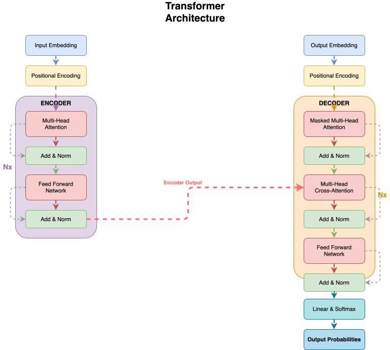
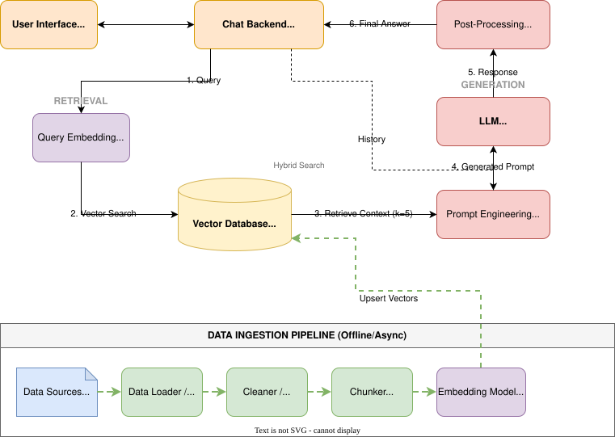
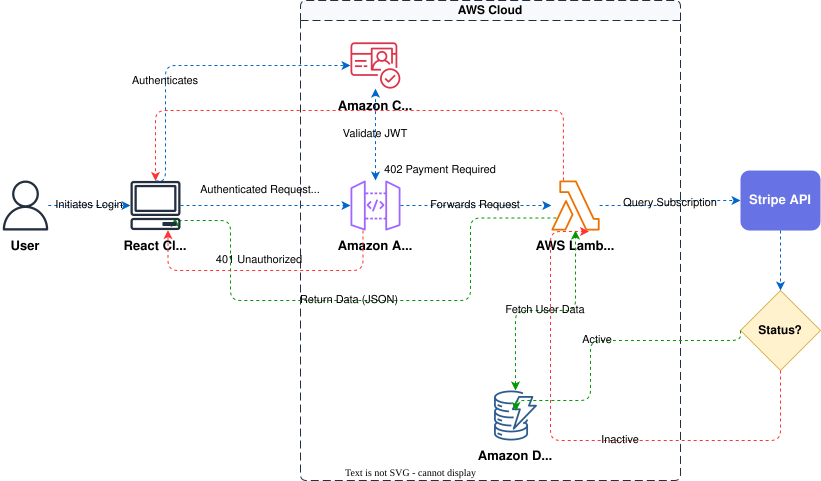
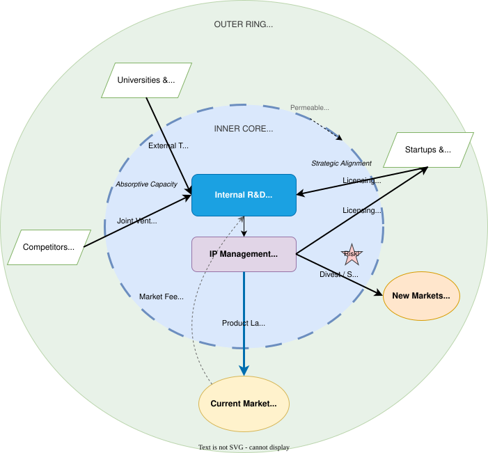
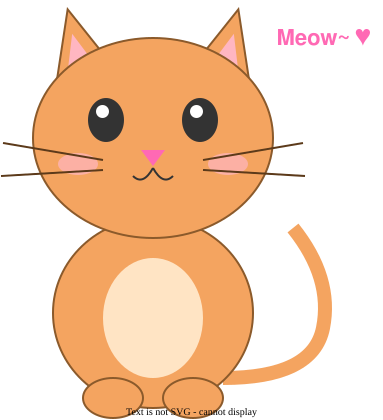

<div align="center">

# Next AI Draw.io

**Draw and edit draw.io diagrams by chatting with an AI.**

English | [中文](./docs/cn/README_CN.md) | [日本語](./docs/ja/README_JA.md)

[](https://opensource.org/licenses/Apache-2.0)
[](https://github.com/sponsors/DayuanJiang)

[**Live Demo**](https://next-ai-drawio.jiang.jp/) · [**Desktop App**](https://github.com/DayuanJiang/next-ai-draw-io/releases) · [**MCP Server**](#in-your-ai-agent-mcp)

</div>

https://github.com/user-attachments/assets/66b9f12f-219f-4d62-acc0-0725e6850eec

Describe a diagram in a sentence and the AI draws it on a real draw.io canvas. Edit it by hand like any draw.io file, or select a few shapes and tell the AI what to change. Every AI change is a version you can compare, restore or undo, and the result exports as `.drawio`, `.png` or `.svg`.

Available as a web app, a desktop app for Windows, macOS and Linux, and an MCP server for AI agents such as Claude Code, Cursor and VS Code.

## Highlights

**Draw**

-   Architecture diagrams, flowcharts, sequence diagrams and more from one sentence, with built-in AWS, Azure, GCP and Kubernetes icon libraries
-   Connectors can carry a flowing animation
-   Upload a screenshot or a sketch and the AI redraws it; upload PDF, Markdown, code and other text files and get a diagram of their content

**Edit**

-   Edit by chat: changes stream onto the canvas and the shapes the AI just changed are highlighted
-   Ask about a selection: select shapes on the canvas and the AI changes only those
-   Versions and undo: every AI change is a version card with a thumbnail; compare it with the canvas, restore it or undo it, and Ctrl+Z on the canvas also takes back an AI change in one step
-   It is a normal draw.io diagram: double-click to rename, drag, restyle, use several pages, and export as `.drawio`, `.png`, `.svg` or `.drawio.svg` at any time

**Use**

-   24 model providers; enter your own API key in the browser and it stays on your machine
-   Models that reason show their thinking
-   Dark mode; the interface is available in English, Simplified Chinese, Traditional Chinese and Japanese

## Examples

<div align="center">
<table width="100%">
  <tr>
    <td colspan="2" valign="top" align="center">
      <strong>Transformer architecture with animated connectors</strong><br />
      <p><strong>Prompt:</strong> Give me a <strong>animated connector</strong> diagram of transformer's architecture.</p>
      
    </td>
  </tr>
  <tr>
    <td width="50%" valign="top">
      <strong>RAG architecture</strong><br />
      <p><strong>Prompt:</strong> Generate a RAG architecture diagram for <strong>chat application</strong>. Use connected diagram for data ingestion</p>
      
    </td>
    <td width="50%" valign="top">
      <strong>Authentication with React and AWS</strong><br />
      <p><strong>Prompt:</strong> Generate authentication process using React with <strong>AWS</strong>. Use Serverless architecture.</p>
      
    </td>
  </tr>
  <tr>
    <td width="50%" valign="top">
      <strong>Open Innovation model</strong><br />
      <p><strong>Prompt:</strong> Create visualization of Henry Chesbrough's Open Innovation model.</p>
      
    </td>
    <td width="50%" valign="top">
      <strong>Cat sketch</strong><br />
      <p><strong>Prompt:</strong> Draw a cute cat for me.</p>
      
    </td>
  </tr>
</table>
</div>

## Use it

### Online demo

Open [next-ai-drawio.jiang.jp](https://next-ai-drawio.jiang.jp/), nothing to install. The demo has a usage limit; click the settings icon in the chat panel and enter your own provider and API key to lift it. The key stays in your browser and is never sent to the server for storage.

### Desktop app

Download the Windows, macOS or Linux installer from the [Releases page](https://github.com/DayuanJiang/next-ai-draw-io/releases).

### In your AI agent (MCP)

Through MCP (Model Context Protocol, the protocol AI agents use to call outside tools), Claude Desktop, Cursor, VS Code and others can draw draw.io diagrams directly. Add this to your client's MCP configuration:

```json
{
  "mcpServers": {
    "drawio": {
      "command": "npx",
      "args": ["@next-ai-drawio/mcp-server@latest"]
    }
  }
}
```

For Claude Code, one command does it:

```bash
claude mcp add drawio -- npx @next-ai-drawio/mcp-server@latest
```

Then ask the AI for "a flowchart of user authentication with login, MFA and session management" and the diagram appears in your browser as it is drawn. The MCP server has most of the web app's drawing features:

-   The same drawing rules and icon libraries (AWS, Azure, GCP, Kubernetes and more)
-   A screenshot tool, so the AI can look at the rendered diagram and fix it
-   Version history, multi-page diagrams, and download as `.drawio`, `.png`, `.svg` or `.drawio.svg`
-   Auto-save to `~/.next-ai-drawio/`, so a diagram survives a restart

See the [MCP server README](./packages/mcp-server/README.md) for VS Code, Cursor and other client configurations.

## Self-host

### Run locally

```bash
git clone https://github.com/DayuanJiang/next-ai-draw-io
cd next-ai-draw-io
npm install
cp env.example .env.local   # add your provider and API key, see "Models and providers" below
npm run dev
```

Open [http://localhost:6002](http://localhost:6002).

### One-click deploy

| Platform | How |
| --- | --- |
| Tencent EdgeOne Pages | [](https://edgeone.ai/pages/new?repository-url=https%3A%2F%2Fgithub.com%2FDayuanJiang%2Fnext-ai-draw-io) Deploying there also gives you a [daily free quota for DeepSeek models](https://pages.edgeone.ai/document/edge-ai) |
| Vercel | [](https://vercel.com/new/clone?repository-url=https%3A%2F%2Fgithub.com%2FDayuanJiang%2Fnext-ai-draw-io) Set the same environment variables in the Vercel dashboard as in your `.env.local` |
| Cloudflare Workers | [Cloudflare deploy guide](./docs/en/cloudflare-deploy.md) |
| Docker | [Docker guide](./docs/en/docker.md) |
| Offline or intranet | [Offline deployment](./docs/en/offline-deployment.md) |

### Models and providers

24 providers are supported: AWS Bedrock (default), OpenAI, Anthropic, Google AI, Google Vertex AI, Azure OpenAI, Ollama, OpenRouter, AIHubMix, DeepSeek, SiliconFlow, SGLang, Vercel AI Gateway, Tencent EdgeOne, ByteDance Doubao, ModelScope, Zhipu GLM, Qwen, Qiniu, Kimi, MiniMax, Novita, Xiaomi MiMo and Atlas Cloud. The environment variables and notes for each are in the [provider configuration guide](./docs/en/ai-providers.md).

**Which model**: the task is to produce long text in a strict format (draw.io XML), so pick a capable model; small models tend to produce broken diagrams.

**Several models and the admin panel**: list several model IDs in `AI_MODEL` separated by commas, or configure models from several providers with the `AI_MODELS_CONFIG` environment variable or an `ai-models.json` file, and every user can use them without a key of their own. Set `ADMIN_PASSWORD` and open `/admin` to manage models, access codes, feature switches, observability and quotas from a web page; see the [admin panel guide](./docs/en/admin-panel.md).

## Support

-   Questions and ideas: open a [GitHub issue](https://github.com/DayuanJiang/next-ai-draw-io/issues) or email me[at]jiang.jp
-   Common problems: [FAQ](./docs/en/FAQ.md)
-   If the project is useful to you, consider [sponsoring](https://github.com/sponsors/DayuanJiang) to help keep the demo site running

<div align="center">

[](https://next-ai-drawio.jiang.jp/)

[](https://www.star-history.com/#DayuanJiang/next-ai-draw-io&type=date&legend=top-left)

</div>
